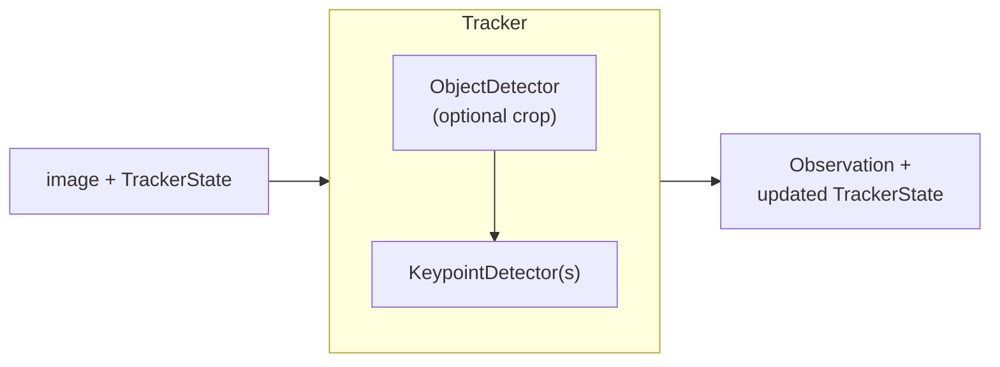

import { AiGeneratedBanner } from '@freemocap/skellydocs';

<AiGeneratedBanner />

# Pipeline Overview

skellytracker makes the **top-down pose-estimation paradigm** a first-class,
composable primitive. An image flows through a `Tracker`, which runs one or more
`DetectionStage`s — each an optional `ObjectDetector` crop followed by one or
more `KeypointDetector`s — and produces a structured `Observation`.

## The pieces

| Piece | Role |
|-------|------|
| [`Tracker`](./trackers-and-sessions.mdx) | Top-level orchestrator; owns stages, runs them in order |
| [`Session`](./trackers-and-sessions.mdx) | Owns GPU/CPU resources for one backend, shared across detectors |
| [`DetectionStage`](./detection-stages.mdx) | One compositional step; can nest child stages |
| [`ObjectDetector` / `KeypointDetector`](./detectors.mdx) | The two primitive detection units |
| [`Observation`](./observations-and-keypoints.mdx) | Per-frame structured output |
| [`TrackerState`](./tracker-state.mdx) | Temporal state, passed in and out each frame |

{/* TODO(prose): expand each row into a paragraph; add the single- vs multi-camera
    data-flow diagrams from rearchitecture-docs/skellytracker-architecture/README.md. */}

## Design principles

- **Top-down by default** — every stage starts with an optional `ObjectDetector`
  that crops the region of interest before keypoints are estimated. With no
  object detector, the full image is used.
- **State is explicit and external** — `TrackerState` is passed into
  `process_image()` and returned updated; the `Tracker` never mutates itself
  between calls, so state is inspectable, serializable, and testable.
- **`Observation` is the contract** — downstream consumers depend only on
  `Observation`; tracker internals stay opaque.
- **`Session` owns resource lifecycle** — GPU sessions and model handles live in
  a `Session`, not inside individual detectors.

{/* SOURCE: rearchitecture-docs/skellytracker-architecture/README.md + 01/03/04. Present-tense only. */}
