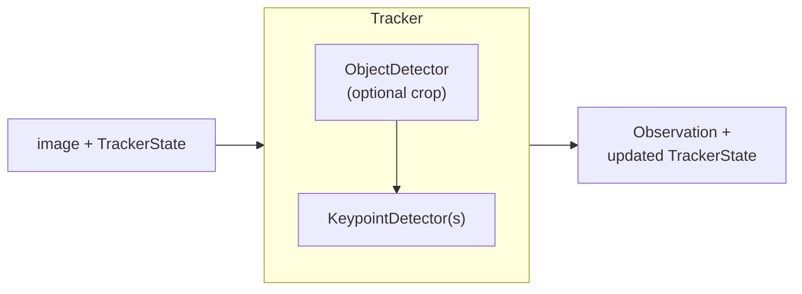

import { AiGeneratedBanner } from '@freemocap/skellydocs';

<AiGeneratedBanner />

:::warning AI GENERATED DOCS
A robot wrote these docs based on the code in the `skellytracker/` repo. Expect jank.

We'll get to human curating and cleaning them up "soon"

For now, they are significantly better than nothing, which is the alternative option :)
:::

# skellytracker

**skellytracker** is the pose-estimation backend for [FreeMoCap](https://freemocap.org).
It collects different pose-estimation tools behind one consistent API built
around a **Tracker → Session → Detector** pipeline, and runs inference on
images, webcams, and videos.

## How it works

An image (plus the current `TrackerState`) flows into a `Tracker`. The tracker
runs one or more **detection stages** — each an optional `ObjectDetector` that
crops a region of interest, followed by one or more `KeypointDetector`s that
estimate points within it — and returns a structured `Observation` together with
an updated `TrackerState`.

Stages compose hierarchically (e.g. a body stage whose crop feeds child hand and
face stages), a `Session` owns the shared GPU/CPU resources for a backend, and
`TrackerState` carries the temporal data used for smoothing across frames.

See [Pipeline Overview](./core-concepts/pipeline-overview.mdx) for the full model.

## Documentation

| Page | Description |
|------|-------------|
| [Installation](./getting-started/installation.mdx) | Install skellytracker and pick a hardware backend |
| [Quick Start](./getting-started/quick-start.mdx) | Run your first inference on an image |
| [Running Demos](./getting-started/running-demos.mdx) | Live webcam demos from the command line |
| [Processing Videos](./getting-started/processing-videos.mdx) | Run trackers over image folders and video files |
| [Pipeline Overview](./core-concepts/pipeline-overview.mdx) | The Tracker → Stage → Detector mental model |
| [Detectors](./core-concepts/detectors.mdx) | Available pose backends (MediaPipe, RTMPose, YOLOX, Aruco, Charuco) |
| [GPU Setup](./guides/gpu-setup.mdx) | Execution providers: CUDA, TensorRT, DirectML, CoreML, CPU |
| [Multi-Camera Batching](./guides/multi-camera-batching.mdx) | Batched inference across N cameras |
| [Architecture](./technical/architecture.mdx) | System overview and data flow |
| [API Reference](./technical/api-reference.mdx) | The public `skellytracker.core` surface |
| [Development](./development/index.mdx) | Run from source, test, and contribute |
| [Community](./community.mdx) | Discord, GitHub, and the project roadmap |

## Community

- **[Discord](https://discord.gg/freemocap)** — support and community discussion
- **[GitHub](https://github.com/freemocap/skellytracker)** — source code and issues
- **[FreeMoCap](https://freemocap.org)** — the parent motion-capture project
