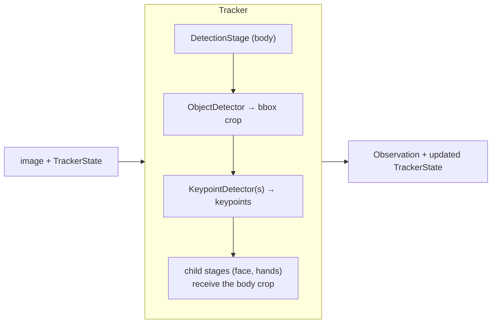
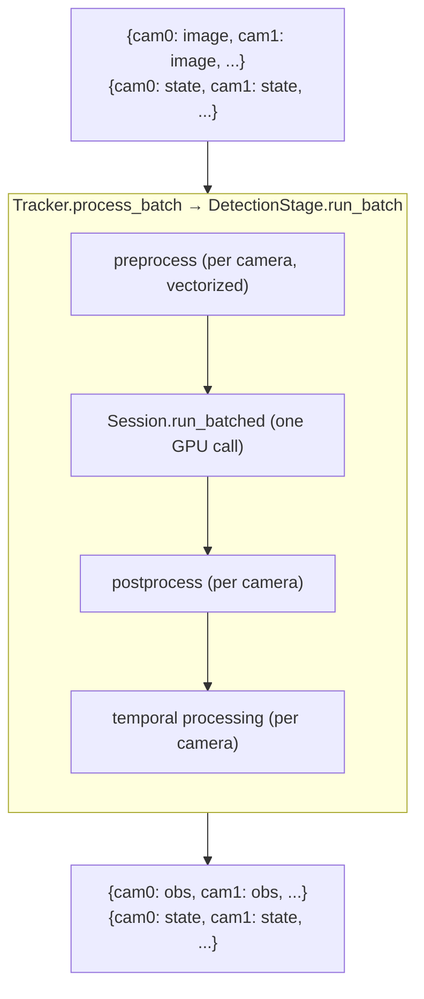

import { AiGeneratedBanner } from '@freemocap/skellydocs';

<AiGeneratedBanner />

# Architecture

An image flows through a `Tracker`, which runs one or more `DetectionStage`s
(each an optional `ObjectDetector` crop followed by one or more
`KeypointDetector`s) and produces a structured `Observation`. Stages nest
hierarchically, a `Session` owns each backend's resources, and per-frame
`TrackerState` carries the temporal data used for smoothing.

## Single-camera flow

## Multi-camera flow (batched)

{/* TODO(prose): expand system overview from
    rearchitecture-docs/skellytracker-architecture/README.md (Data Flow section).
    Present-tense description of the current system only — do NOT port the
    "Comparison with Current Architecture" table. */}

## See also

- [Pipeline Overview](../core-concepts/pipeline-overview.mdx)
- [Multi-Camera Batching](../guides/multi-camera-batching.mdx)
- [ONNX Batching & CoreML](./onnx-batching-and-coreml.mdx)
